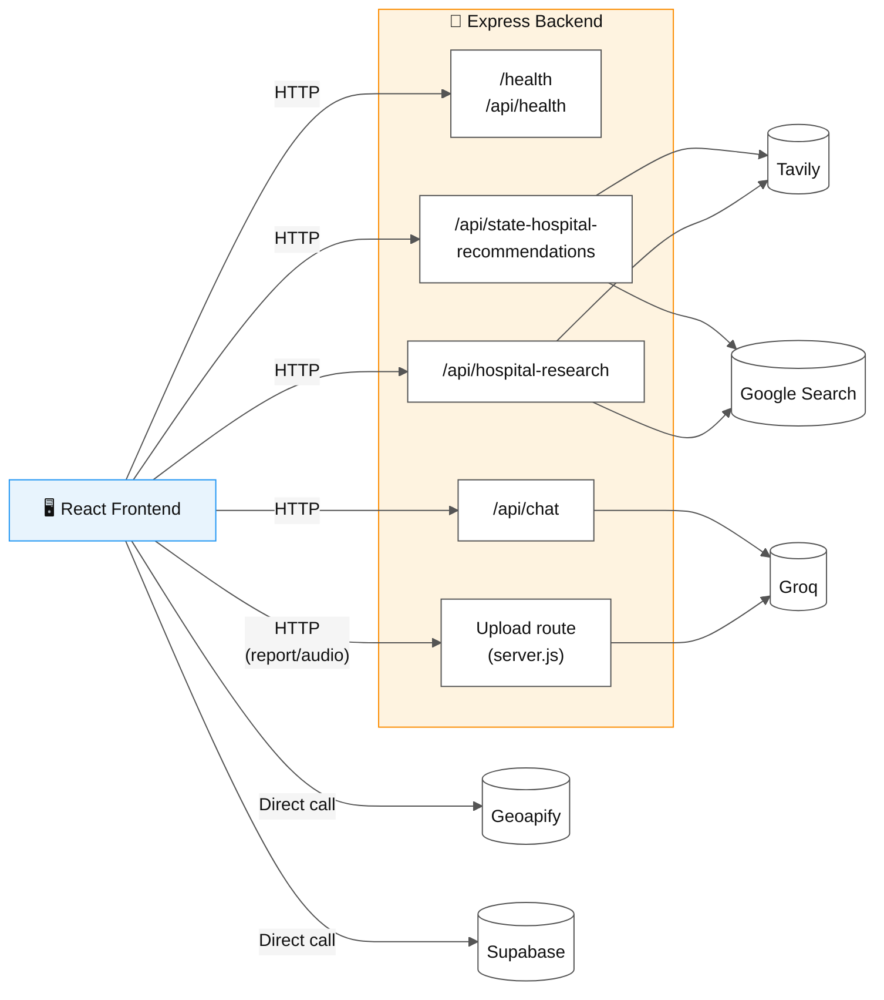
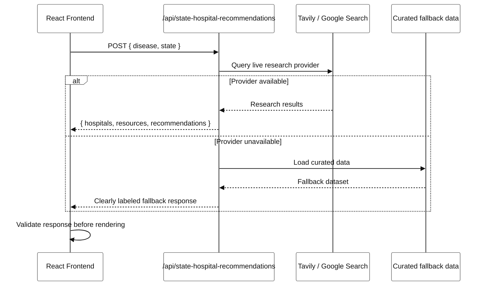
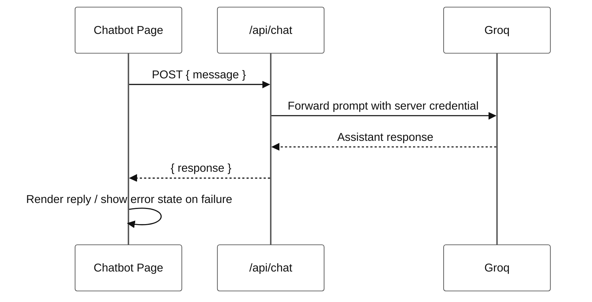
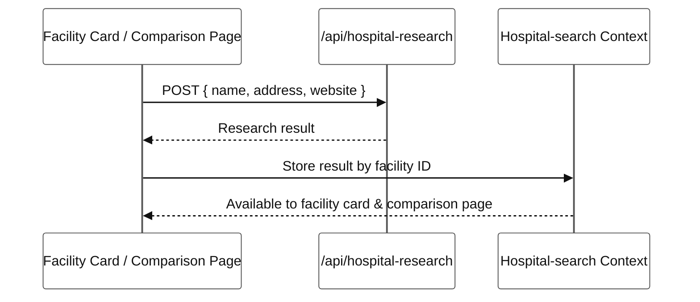

# 🔌 API and Integration Summary

The Express backend connects the React application to AI, research, upload, and health-check services. The frontend uses **Geoapify directly** for nearby healthcare search, and uses the **backend** for provider integrations that require server-side credentials.

---

## 📋 Table of contents

- [Integration flow at a glance](#-integration-flow-at-a-glance)
- [Backend endpoints](#-backend-endpoints)
- [Main request examples](#-main-request-examples)
- [Integration responsibilities](#-integration-responsibilities)
- [Implementation principles](#-implementation-principles)

---

## 🗺️ Integration flow at a glance



**Key principle:** every route that needs a secret provider key sits behind the backend; the frontend only talks directly to services that use publishable/client-safe keys (Geoapify, Supabase).

---

## 🧭 Backend endpoints

| Method | Endpoint | Purpose |
| --- | --- | --- |
| `GET` | `/health` | Confirms that the backend is running |
| `GET` | `/api/health` | API health check |
| `POST` | `/api/state-hospital-recommendations` | Returns researched or fallback hospital recommendations |
| `POST` | `/api/chat` | Sends a message to the healthcare assistant |
| `POST` | Upload route in `src/server/server.js` | Processes report/audio assistant inputs |
| `POST` | `/api/hospital-research` | Researches a selected hospital |

---

## 📨 Main request examples

### 1. Hospital recommendations



**Request:**

```json
{
  "disease": "kidney treatment",
  "state": "Punjab"
}
```

The response may contain `hospitals`, `resources`, or `recommendations`. The frontend validates the response and falls back to curated data when live research is unavailable.

---

### 2. Healthcare assistant



**Request:**

```json
{
  "message": "What should I consider when comparing hospitals?"
}
```

The assistant uses the configured Groq integration and returns a response handled by the chatbot page.

---

### 3. Hospital research



**Request:**

```json
{
  "name": "Example Hospital",
  "address": "Example address, India",
  "website": "https://example.org"
}
```

The result is stored by facility ID in the shared hospital-search context so the facility card and comparison page can use it.

---

## 🧩 Integration responsibilities

| Integration | Responsibility |
| --- | --- |
| **Geoapify** | Nearby healthcare facilities and location search |
| **Express** | Backend API boundary and provider orchestration |
| **Groq** | AI assistant and speech-related processing |
| **Tavily / Google** | Optional hospital research providers |
| **Supabase** | Authentication and profile-related services |
| **Map / route providers** | Facility maps and navigation support |

---

## 🛡️ Implementation principles

- 🔐 Provider secrets remain on the backend.
- ✅ Request and response data is validated before rendering.
- ⏳ Async operations expose loading, empty, success, and error states.
- ⚠️ Provider failures produce explicit user-facing errors or clearly labeled curated fallbacks.
- 📄 The full implementation is in [`src/server/server.js`](../src/server/server.js).
