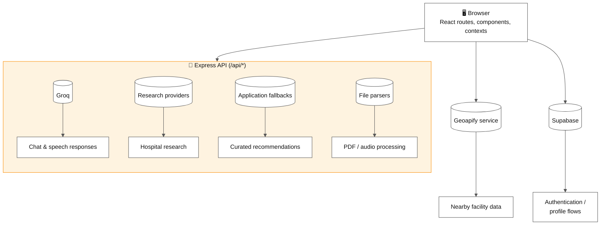
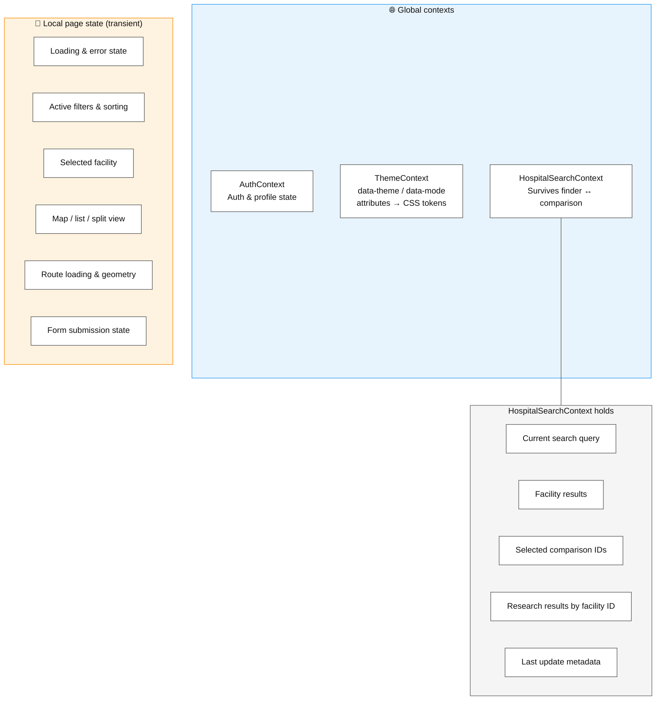
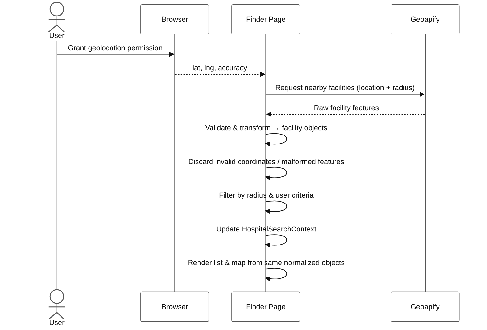
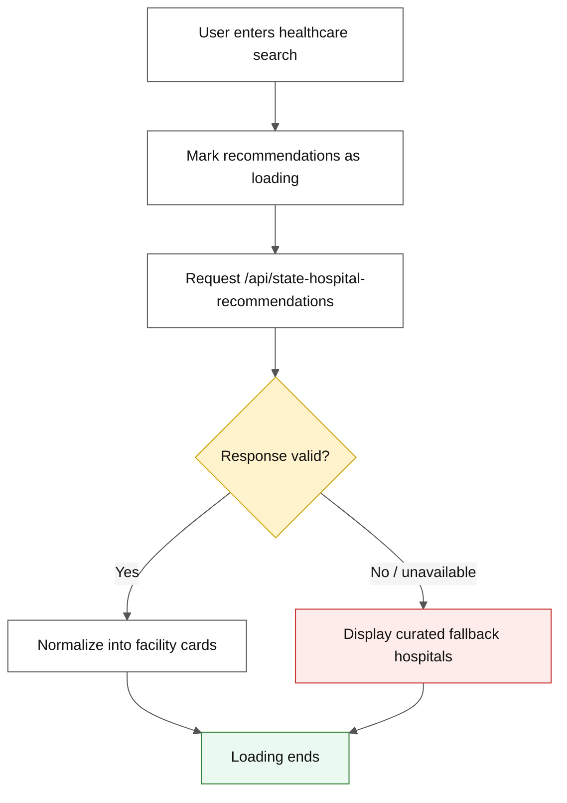
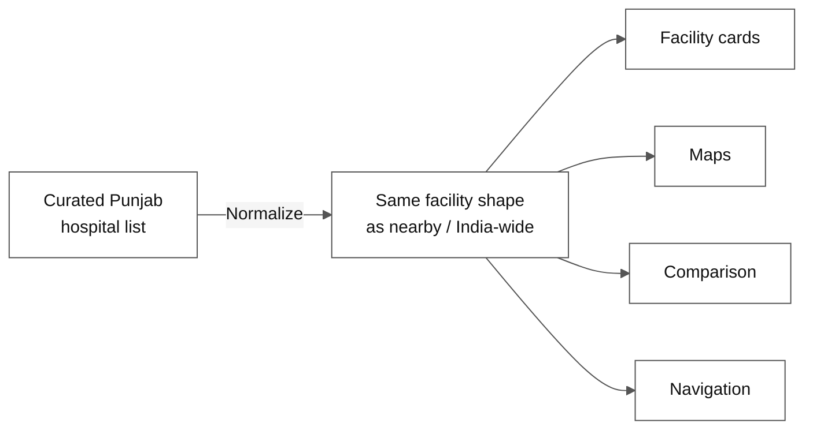
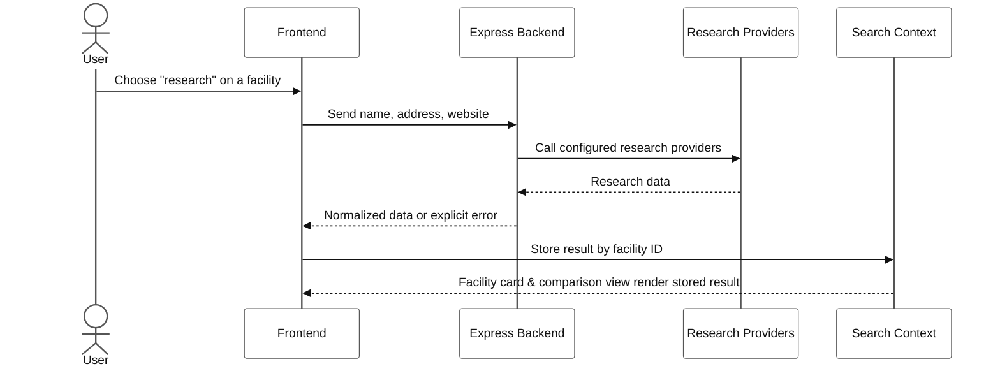
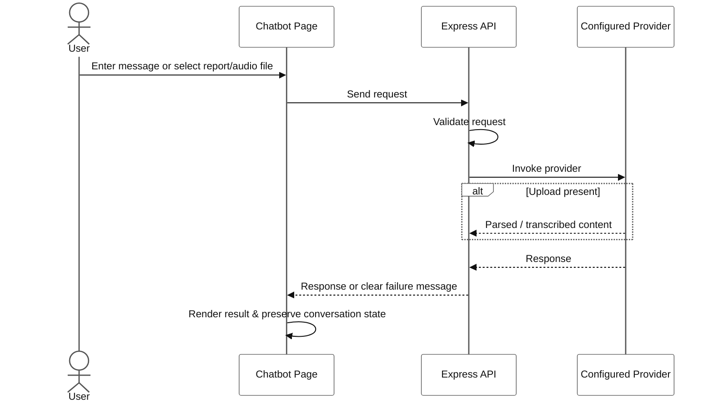

# 🔄 CurePulse Data Flow

## 📋 Table of contents

- [System overview](#-system-overview)
- [Frontend state ownership](#-frontend-state-ownership)
- [Nearby search flow](#-nearby-search-flow)
- [India-wide recommendation flow](#-india-wide-recommendation-flow)
- [Punjab state-level flow](#-punjab-state-level-flow)
- [Hospital research flow](#-hospital-research-flow)
- [Chatbot and upload flow](#-chatbot-and-upload-flow)
- [Error and fallback principles](#-error-and-fallback-principles)

---

## 🗺️ System overview

---

## 🗂️ Frontend state ownership

| Context | Owns |
| --- | --- |
| **`AuthContext`** | Authentication and profile-related state. Shared navigation controls use this to render the correct signed-in / signed-out experience. |
| **`ThemeContext`** | The active visual theme and mode. Applied via `data-theme` and `data-mode` attributes consumed by the CSS token system. |
| **`HospitalSearchContext`** | Search state that needs to survive between the finder and comparison experiences — query, facility results, comparison IDs, research results by facility ID, and last-update metadata. |
| **Local page state** | Transient concerns: loading/error state, filters/sorting, selected facility, current view, route geometry, form status. |

---

## 📍 Nearby search flow

1. The browser requests geolocation permission.
2. The finder receives latitude, longitude, and accuracy.
3. The frontend calls the Geoapify service with the location and radius.
4. Geoapify features are validated and transformed into application facility objects.
5. Invalid coordinates or malformed features are discarded.
6. Results are filtered by radius and user-selected criteria.
7. The search context is updated for comparison and later navigation.
8. The list and map render the same normalized facility objects.

---

## 🌏 India-wide recommendation flow

1. The user enters a healthcare search.
2. The frontend marks recommendations as loading.
3. The frontend requests `/api/state-hospital-recommendations`.
4. The response is validated before its recommendation data is used.
5. The results are normalized into facility cards.
6. If research is unavailable, curated fallback hospitals are displayed.
7. Loading ends only after facilities are available or an error/fallback is established.

---

## 📌 Punjab state-level flow

The state-level UI currently uses a curated list of top Punjab hospitals. This provides a predictable state-level experience and avoids presenting empty or unrelated results when a user selects the state-level option.

The curated entries are normalized into the same facility shape used by nearby and India-wide results, so cards, maps, comparison, and navigation can reuse the same presentation logic.

---

## 🔬 Hospital research flow

1. A user chooses a research action on a facility.
2. The frontend sends the facility name, address, and website to the backend.
3. The backend calls configured research providers.
4. The backend returns normalized research data or an explicit error.
5. The frontend stores the result by facility ID in search context.
6. The facility card and comparison view can render the stored result.

---

## 🤖 Chatbot and upload flow

1. The user enters a message or selects a report/audio file.
2. The frontend sends the request to the Express API.
3. The backend validates the request and invokes the configured provider.
4. Uploaded content is parsed or transcribed when the relevant service is configured.
5. The backend returns a response or a clear failure message.
6. The frontend renders the assistant result and preserves the conversation state required by the page.

---

## ⚠️ Error and fallback principles

- 🚫 Never treat an unfinished request as an empty result.
- ⏳ Set loading state before starting an async operation.
- ✅ Validate HTTP status and response shape.
- 🔔 Show a user-readable error when a provider fails.
- 📋 Use curated fallback data only when it is clearly presented as a starting point.
- 🕒 Keep stale responses from overwriting newer searches.
- 🔐 Do not expose provider credentials in frontend code.