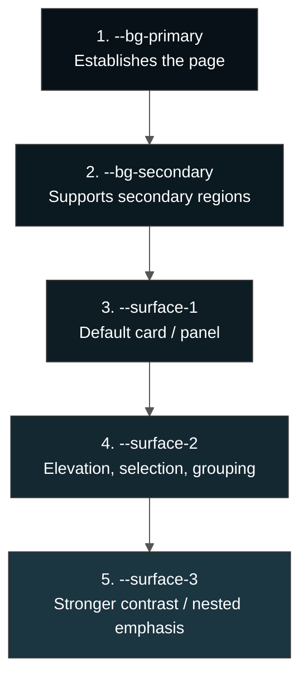
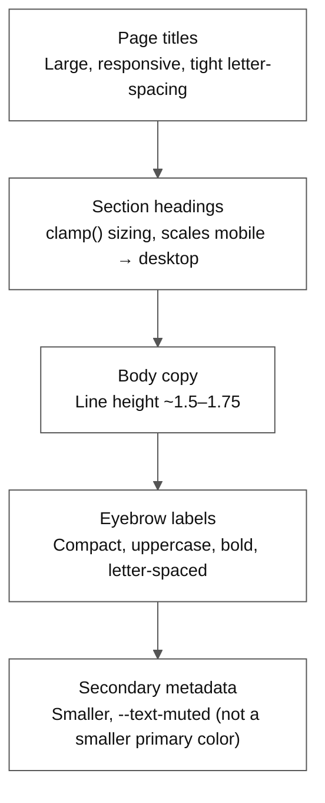
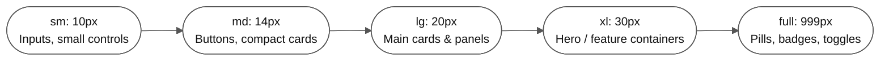
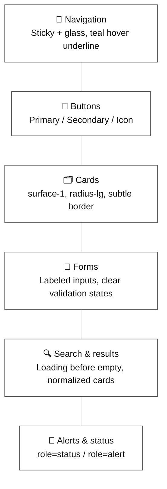
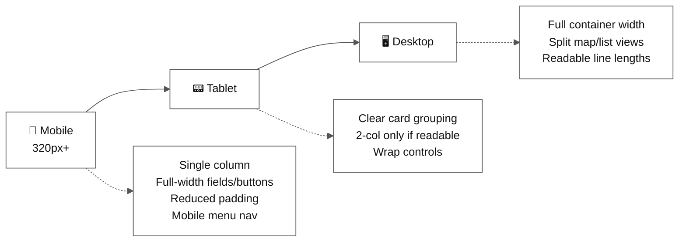

# 🎨 CurePulse Design System

This document describes the visual theme, styling tokens, layout conventions, component patterns, and interaction principles used by CurePulse.

The design direction is **calm, trustworthy healthcare technology**: a dark blue-green foundation, clinical teal accents, restrained blue highlights, generous spacing, and clear information hierarchy. The interface should feel modern and capable without becoming visually noisy or making healthcare information feel promotional.

---

## 📋 Table of contents

- [Design goals](#-design-goals)
- [Theme identity](#-theme-identity)
- [Color system](#-color-system)
- [Typography](#-typography)
- [Layout and spacing](#-layout-and-spacing)
- [Shape language](#-shape-language)
- [Surfaces, glass, and shadows](#-surfaces-glass-and-shadows)
- [Gradients and atmosphere](#-gradients-and-atmosphere)
- [Component styling conventions](#-component-styling-conventions)
- [Interaction and motion](#-interaction-and-motion)
- [Responsive behavior](#-responsive-behavior)
- [Accessibility requirements](#-accessibility-requirements)
- [Asset and imagery guidance](#-asset-and-imagery-guidance)

---

## 🎯 Design goals

The visual system is designed to:

- Make healthcare discovery feel safe, clear, and approachable.
- Prioritize search, recommendations, maps, and actions over decoration.
- Establish trust through consistent spacing, readable typography, and restrained color use.
- Keep high-information screens scannable on desktop and mobile.
- Make asynchronous states, errors, and safety guidance visible.
- Support both dark and light presentation modes without changing the product identity.
- Provide reusable tokens and patterns so new features remain consistent.

---

## 🪪 Theme identity

### Theme name

The primary healthcare theme is named **`vital`** and is applied through:

```html
<html data-theme="vital" data-mode="dark">
```

The active theme and mode are managed by the existing `ThemeProvider` / `ThemeContext` implementation.

```mermaid
flowchart LR
    %%{init: {'theme':'base', 'themeVariables': {'primaryColor':'#ffffff','primaryTextColor':'#111111','primaryBorderColor':'#555555','lineColor':'#555555','secondaryColor':'#f5f5f5','tertiaryColor':'#ffffff','fontSize':'15px','darkMode':false,'background':'#ffffff'}}}%%
    TP["ThemeProvider /\nThemeContext"] -->|"sets"| ATTR["data-theme=\"vital\"\ndata-mode=\"dark|light\""]
    ATTR --> CSS["src/styles/themes.css\nCSS custom properties"]
    CSS --> COMP["Components read\ntokens, not hard-coded colors"]

    style TP fill:#e8f4fd,stroke:#2196F3,color:#111111
    style ATTR fill:#fef3e0,stroke:#FB8C00,color:#111111
    style COMP fill:#eafaf1,stroke:#2E7D32,color:#111111
```

### Brand character

| Characteristic | Visual expression |
| --- | --- |
| 🤝 Trustworthy | Deep blue-green surfaces and strong contrast |
| 💚 Healthy | Teal primary accent |
| 🧠 Intelligent | Blue secondary accent and subtle gradients |
| 🌊 Calm | Low-noise backgrounds and restrained shadows |
| 🎯 Practical | Compact controls, clear labels, and direct actions |
| 🫶 Human | Rounded cards, friendly copy, and visible status feedback |

---

## 🌈 Color system

All reusable colors should use CSS custom properties from `src/styles/themes.css`. Do not introduce feature-specific hard-coded colors when an existing token expresses the same intent.

### Brand accents

| Swatch | Token | Value | Intended use |
| --- | --- | --- | --- |
|  | `--accent-primary` | `#32c8c0` | Primary actions, active states, healthcare highlights |
|  | `--accent-secondary` | `#5c8ff7` | Secondary emphasis, gradients, map/research accents |
|  | `--accent-gradient` | Teal to blue | Hero accents and selected high-value controls |

> The primary teal should be the dominant action color. The secondary blue is used to create depth and differentiate supporting information. **Neither accent should be used for large blocks of body text.**

### Dark mode — deep blue-green, not pure black

| Swatch | Token | Value |
| --- | --- | --- |
|  | `--bg-primary` | `#071117` |
|  | `--bg-secondary` | `#0b1920` |
|  | `--surface-1` | `#0e1d24` |
|  | `--surface-2` | `#142832` |
|  | `--surface-3` | `#1b3541` |
|  | `--text-primary` | `#f3fbfc` |
|  | `--text-secondary` | `#b4c8cc` |
|  | `--text-muted` | `#758b91` |

Dark surfaces should be **layered**, not replaced with black — `--surface-1` for cards and panels, `--surface-2` for raised or selected elements, `--surface-3` for stronger emphasis.

### Light mode — cool near-white with blue-green surfaces

| Swatch | Token | Value |
| --- | --- | --- |
|  | `--bg-primary` | `#f4fafb` |
|  | `--bg-secondary` | `#ffffff` |
|  | `--surface-1` | `#ffffff` |
|  | `--surface-2` | `#eef6f7` |
|  | `--surface-3` | `#e1eef0` |
|  | `--text-primary` | `#122126` |
|  | `--text-secondary` | `#566b70` |
|  | `--text-muted` | `#84979b` |

### Surface layering



### Borders and state colors

| Token | Purpose |
| --- | --- |
| `--border-subtle` | Section separators and low-emphasis outlines |
| `--border-default` | Card, input, and control borders |
| `--border-strong` | Hover, focus, selected, or emphasized borders |
| `--border-glow` | Accent-tinted visual emphasis |
| `--glow-primary` | Teal ambient glow |
| `--glow-secondary` | Blue ambient glow |

> Use borders to define structure without making every element look boxed in. Prefer a subtle border plus surface contrast over a heavy outline.

### Medical safety and status colors

Safety and emergency states may use a distinct warning or emergency color, but they must remain semantically clear and meet contrast requirements. **Do not use the brand teal to represent danger or an error.**

| Role | Color | Swatch |
| --- | --- | --- |
| ✅ Success | Teal or a sufficiently contrasted positive green |  |
| ℹ️ Information | Secondary blue |  |
| ⚠️ Warning | Amber / yellow |  |
| 🚨 Error / emergency | Red |  |
| ⬜ Muted / disabled | `--text-muted` with reduced emphasis |  |

---

## ✍️ Typography

### Font families

```css
--font-body:
  Inter, system-ui, -apple-system, BlinkMacSystemFont, "Segoe UI", sans-serif;

--font-display:
  Inter, system-ui, -apple-system, BlinkMacSystemFont, "Segoe UI", sans-serif;

--font-mono: "SFMono-Regular", Consolas, "Liberation Mono", monospace;
```

| Token | Use |
| --- | --- |
| `--font-body` | Normal interface text, labels, forms, navigation |
| `--font-display` | Page titles, section headings, prominent product messaging |
| `--font-mono` | Technical labels, eyebrow text, metadata, compact status identifiers |

### Type hierarchy



> Avoid using font size alone to communicate hierarchy. Combine size, weight, color, spacing, and placement.

---

## 📐 Layout and spacing

### Spacing scale

```mermaid
flowchart LR
    %%{init: {'theme':'base', 'themeVariables': {'primaryColor':'#ffffff','primaryTextColor':'#111111','primaryBorderColor':'#555555','lineColor':'#555555','secondaryColor':'#f5f5f5','tertiaryColor':'#ffffff','fontSize':'13px','darkMode':false,'background':'#ffffff'}}}%%
    S1["1: 4px"] --> S2["2: 8px"] --> S3["3: 12px"] --> S4["4: 16px"] --> S5["5: 20px"] --> S6["6: 24px"] --> S8["8: 32px"] --> S10["10: 40px"] --> S12["12: 48px"] --> S16["16: 64px"] --> S20["20: 80px"] --> S24["24: 96px"] --> S32["32: 128px"]
```



| Token | Value | | Token | Value |
| --- | --- | --- | --- | --- |
| `--container-width` | `1200px` | | `--space-8` | `32px` |
| `--container-padding` | `24px` | | `--space-10` | `40px` |
| `--space-1` | `4px` | | `--space-12` | `48px` |
| `--space-2` | `8px` | | `--space-16` | `64px` |
| `--space-3` | `12px` | | `--space-20` | `80px` |
| `--space-4` | `16px` | | `--space-24` | `96px` |
| `--space-5` | `20px` | | `--space-32` | `128px` |
| `--space-6` | `24px` | | | |

Use the spacing scale instead of inventing arbitrary values. Small controls normally use **8–16px** internal spacing, cards use **20–32px**, and major sections use **64–128px** vertical rhythm depending on screen size.

### Containers

- Keep primary content within `--container-width`.
- Use `--container-padding` at the viewport edge.
- Center large content areas with `margin: 0 auto`.
- Allow dense result screens to use wider layouts than editorial pages.
- Avoid full-width text blocks that become difficult to read.

### Grids and flex

| Use **CSS Grid** for | Use **Flexbox** for |
| --- | --- |
| Two-column detail/sidebar and contact/form screens | Navigation and action rows |
| Result list and map split views for hospital discovery | Button contents |
| Responsive single-column collapse below breakpoint | Compact metadata and status groups |
| | Vertical form layouts |

---

## 🔲 Shape language

The product uses rounded but controlled geometry:



| Token | Value | Use |
| --- | --- | --- |
| `--radius-sm` | `10px` | Inputs, small controls, icon containers |
| `--radius-md` | `14px` | Buttons, compact cards |
| `--radius-lg` | `20px` | Main cards and panels |
| `--radius-xl` | `30px` | Hero or feature containers |
| `--radius-full` | `999px` | Pills, badges, toggles, nav indicators |

> Corner radius should communicate grouping, not make every element look like a pill. Use full rounding only for tags, status badges, and compact toggles.

---

## 🪟 Surfaces, glass, and shadows

### Glass navigation

The primary site navigation uses the `glass` variant:

- Semi-transparent `--glass-background`
- `backdrop-filter: blur(var(--glass-blur))`
- A subtle `--glass-border`
- Sticky positioning at the top of the page

> Glass treatment should be used **selectively** — appropriate for navigation and floating controls, not for every card or section.

### Shadows

| Token | Purpose |
| --- | --- |
| `--shadow-sm` | Small control or card elevation |
| `--shadow-md` | Standard raised panel |
| `--shadow-lg` | Hero or modal emphasis |
| `--card-hover-shadow` | Interactive card hover state |
| `--button-shadow` | Primary action emphasis |

> Shadows should remain soft and tinted toward the blue-green palette. Avoid hard black shadows that make healthcare screens feel heavy.

---

## 🌫️ Gradients and atmosphere

The `vital` theme uses low-opacity radial glows:

- Teal glow near the upper-left
- Blue glow near the upper-right
- Very subtle teal/blue glow near the lower page

```css
--background-gradient
--ambient-gradient
--surface-gradient
--accent-gradient
```

> Use ambient gradients for depth **behind** content, not as a replacement for surface contrast. Background decoration must remain `pointer-events: none` and must never reduce text readability.

---

## 🧩 Component styling conventions



### Navigation

- Use the shared `SiteNavbar` and `Navbar` components.
- Default navigation is sticky and glass-styled.
- Desktop navigation uses muted text and a teal underline for hover/active state.
- The primary CTA uses the accent gradient or primary accent.
- Preserve a clear mobile menu and do not hide essential navigation behind hover-only interactions.

### Buttons

| Type | Styling |
| --- | --- |
| **Primary** | `--accent-primary` or `--accent-gradient`; dark text when contrast permits; min height ~44–50px; clear hover lift with subtle accent shadow |
| **Secondary** | `--surface-1` or `--surface-2`; `--border-default`, strengthened on hover; preserve primary text contrast |
| **Icon buttons** | Must have an accessible label / `aria-label`; large enough for comfortable pointer and touch interaction |

### Cards

- Use `--surface-1` with a subtle border.
- Use `--radius-lg` for major content cards.
- Keep headings, metadata, actions, and status badges visually distinct.
- Use hover elevation only when the card is interactive.
- Avoid excessive nested borders.

### Forms

- Every input must have a visible label or accessible label association.
- Use `--bg-secondary` for input backgrounds.
- Use `--border-default` normally and `--accent-primary` on focus.
- Focus states should include a visible border and a soft focus ring.
- Use clear validation, loading, success, and error messages.
- Never imply that a form was delivered to a real person unless the backend actually sent it. Local/demo confirmations should be clearly scoped by the product behavior.

### Search and results

- Search controls should be visually dominant on discovery pages.
- Loading states should appear before empty states while requests are active.
- Result counts and data-source labels should use compact metadata styling.
- Facility cards should prioritize name, location, specialty, match, distance, and actionable controls.
- Map and list views should preserve the same selected-facility state.

### Alerts and status messages

- Use a distinct container for errors and important warnings.
- State the issue in plain language and provide a next step where possible.
- Use `role="status"` for non-blocking success/loading updates.
- Use `role="alert"` for errors that require immediate attention.

---

## 🎬 Interaction and motion

| Token | Value | Use |
| --- | --- | --- |
| `--transition-fast` | `150ms ease` | Hover color, focus, small control changes |
| `--transition-normal` | `250ms ease` | Panels, navigation, surface changes |
| `--transition-slow` | `450ms ease` | Larger visual transitions |

Preferred interaction patterns:

- Small hover lift for primary buttons and interactive cards.
- Color and border transitions for navigation and inputs.
- Underline scale animation for active navigation links.
- Spinner or progress indicator for network operations.

> Respect `prefers-reduced-motion`. Nonessential transforms and animated decoration should be reduced or disabled for users who request reduced motion.

---

## 📱 Responsive behavior

The interface must work from a minimum viewport width of **320px** upward.



| Breakpoint | Key behaviors |
| --- | --- |
| **Mobile** | Collapse multi-column layouts into one column; full-width fields/buttons when needed; reduced section padding while preserving breathing room; reachable/readable map-list controls; accessible mobile menu; avoid unintended horizontal scroll |
| **Tablet** | Preserve clear card grouping; two-column layouts only when each column stays readable; let controls wrap rather than compressing text |
| **Desktop** | Full content container width; generous section spacing; split views for map/list discovery and comparison; readable line lengths even on large screens |

---

## ♿ Accessibility requirements

Visual design must support accessible interaction:

- Maintain readable contrast in both `vital` dark and light modes.
- Never communicate status by color alone.
- Provide visible keyboard focus states.
- Use semantic headings in order.
- Associate labels with form controls.
- Give icon-only controls accessible names.
- Ensure interactive targets are comfortably sized.
- Preserve readable text when ambient gradients or images are present.
- Respect reduced motion preferences.
- Announce asynchronous success and error states appropriately.

---

## 🖼️ Asset and imagery guidance

- Use healthcare imagery only as supporting context.
- Apply overlays to maintain text contrast over photography.
- Prefer high-quality, appropriately sized assets.
- Use the provided CurePulse logo assets from `public/`.
- Do not use decorative imagery where it competes with search or medical information.
- Optimize large images and avoid unnecessary loading above the fold.