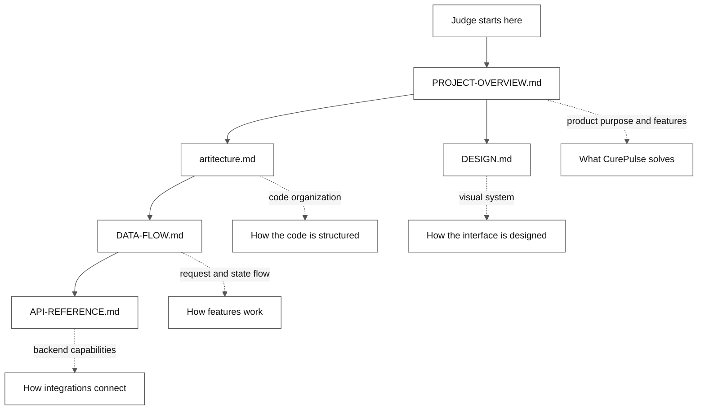

# CurePulse Judge Documentation

This folder contains only the documentation needed to understand and evaluate
the CurePulse product.

## Documentation map

## Recommended reading order

1. [PROJECT-OVERVIEW.md](./PROJECT-OVERVIEW.md) - Product purpose, users,
   features, routes, and scope.
2. [artitecture.md](./artitecture.md) - Code organization and maintainability.
3. [DATA-FLOW.md](./DATA-FLOW.md) - How the frontend, backend, and integrations
   work together.
4. [DESIGN.md](./DESIGN.md) - Theme, styling, responsive behavior, and
   accessibility.
5. [API-REFERENCE.md](./API-REFERENCE.md) - Important backend capabilities.

For installation and deployment commands, use the root
[README.md](../README.md).
