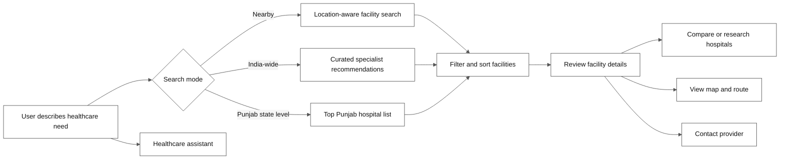
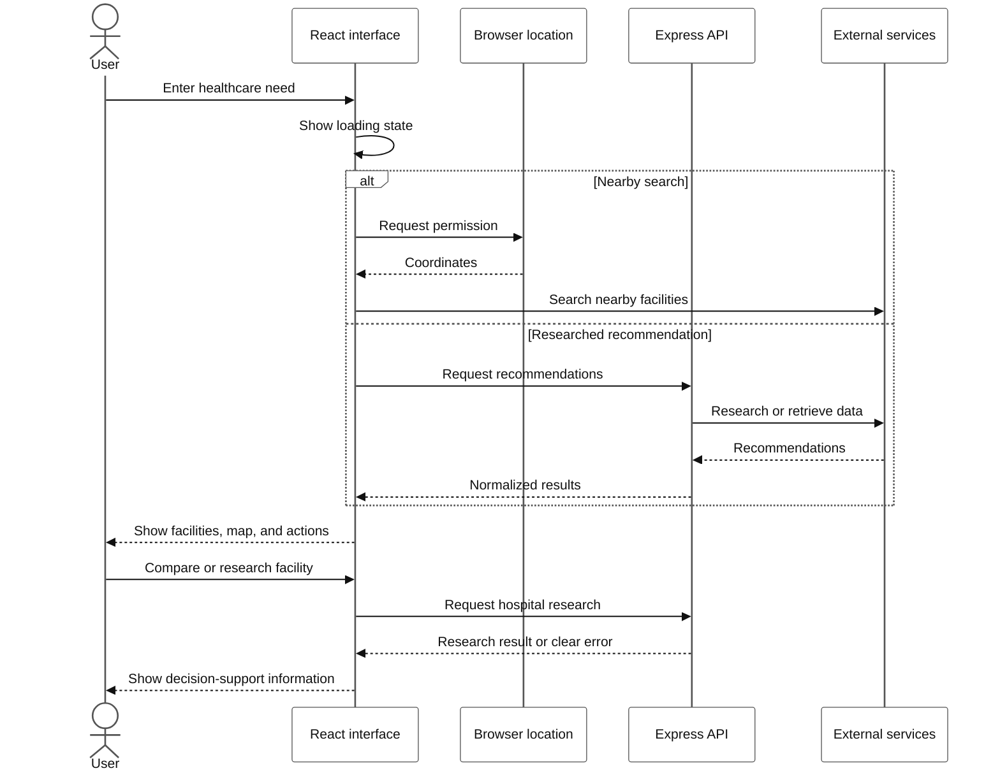

# CurePulse Project Overview

## Executive summary

CurePulse is a healthcare discovery platform that helps people search for
healthcare facilities, compare hospitals, understand available care options,
and access guided assistance from one web application.

The product combines:

- Location-aware nearby healthcare discovery.
- Curated India-wide and Punjab state-level recommendations.
- Facility comparison and hospital research.
- Interactive maps and route support.
- An AI-assisted healthcare chatbot.
- Authentication, profile, FAQ, contact, team, and analytics experiences.

## Product journey

The primary value chain is from a plain-language healthcare need to a
shortlist of facilities and an actionable next step.

## Problem being addressed

Healthcare information is often fragmented across map listings, hospital
websites, search results, and informal recommendations. Users may know what
care they need but not which facilities are nearby, what specialties they
offer, or how to compare their options.

CurePulse provides a guided discovery layer that helps users move from a
healthcare need to a shortlist of facilities and useful next actions.

## Product capability map

```mermaid
%%{init: {'theme':'base', 'themeVariables': {'primaryColor':'#ffffff','primaryTextColor':'#111111','primaryBorderColor':'#555555','lineColor':'#555555','secondaryColor':'#f5f5f5','tertiaryColor':'#ffffff','fontSize':'15px','darkMode':false,'background':'#ffffff'}}}%%
flowchart TB
    CP((CurePulse))
    CP --> DISCOVER[Discover]
    CP --> DECIDE[Decide]
    CP --> ACT[Act]
    CP --> ASSIST[Assist]
    CP --> TRUST[Trust]
    DISCOVER --> D1[Condition search]
    DISCOVER --> D2[Nearby hospitals]
    DISCOVER --> D3[India-wide recommendations]
    DISCOVER --> D4[Punjab state hospitals]
    DECIDE --> E1[Facility details]
    DECIDE --> E2[Filters and sorting]
    DECIDE --> E3[Hospital comparison]
    DECIDE --> E4[Hospital research]
    ACT --> F1[Map and route]
    ACT --> F2[Google Maps navigation]
    ACT --> F3[Provider contact]
    ASSIST --> G1[AI healthcare chatbot]
    ASSIST --> G2[PDF/report assistance]
    ASSIST --> G3[FAQ and support]
    TRUST --> H1[Loading and error states]
    TRUST --> H2[Medical safety boundaries]
    TRUST --> H3[Authentication]
```

## Product goals

1. Reduce the effort required to discover relevant healthcare facilities.
2. Make location and distance part of the decision process.
3. Present recommendations in a clear, comparable format.
4. Give users a practical way to research and navigate to a facility.
5. Make AI assistance useful while clearly communicating its limitations.
6. Keep the codebase modular enough for long-term feature development.

## Feature areas

| Area | User value |
| --- | --- |
| Healthcare finder | Finds facilities by condition, treatment, or specialty |
| Nearby search | Uses the user's location to show nearby options |
| India research | Provides curated specialist starting points |
| Punjab state search | Shows a focused list of top Punjab hospitals |
| Comparison | Helps users compare selected facilities |
| Research | Enriches hospital cards with additional information |
| Maps | Shows facilities and supports route discovery |
| Chatbot | Provides guided healthcare information and report assistance |
| Accounts | Supports authentication and profile-related flows |
| Support pages | Explains the product and provides FAQ/contact access |

## Intended audience

- Patients and families beginning healthcare research.
- People looking for hospitals near their current location.
- Users comparing facilities before contacting a provider.
- People who need a simple starting point for specialty care.
- Evaluators reviewing a modular healthcare technology prototype.

## Product boundaries

CurePulse is not:

- A diagnostic service.
- A replacement for a doctor or emergency service.
- A guarantee that a hospital has an open appointment or available bed.
- A substitute for verifying current provider information.

Recommendations and external data should be treated as discovery aids. Users
must confirm medical, availability, pricing, and emergency details directly
with the facility.

## Application routes

| Route | Purpose |
| --- | --- |
| `/` | Home and product entry points |
| `/find-hospitals` | Healthcare facility search and map |
| `/compare` | Compare selected hospitals |
| `/chatbot` | AI healthcare assistant |
| `/team` | Project/team information |
| `/faq` | Frequently asked questions |
| `/contact` | Contact form and support information |
| `/analytics` | Analytics view |

Unknown routes fall back to the home page.

## High-level user experience

## Success indicators

The product is successful when a user can:

1. State a healthcare need in plain language.
2. See an understandable loading state while data is retrieved.
3. Review relevant facility results.
4. Inspect location, specialty, and distance information.
5. Compare or research promising facilities.
6. Open navigation or contact the provider.
7. Understand what the platform can and cannot guarantee.
