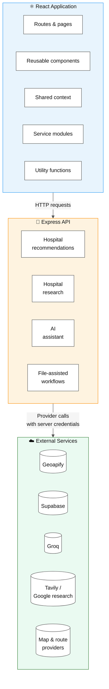
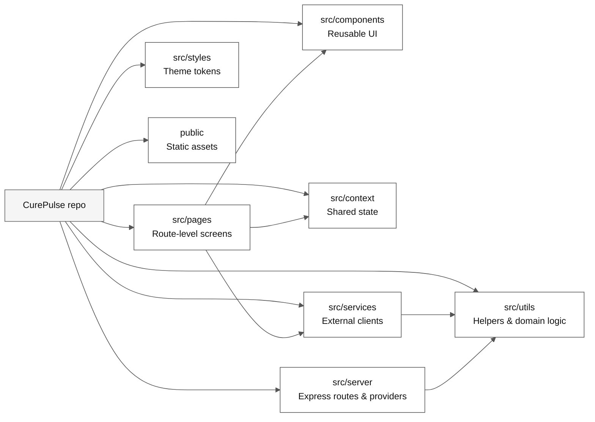
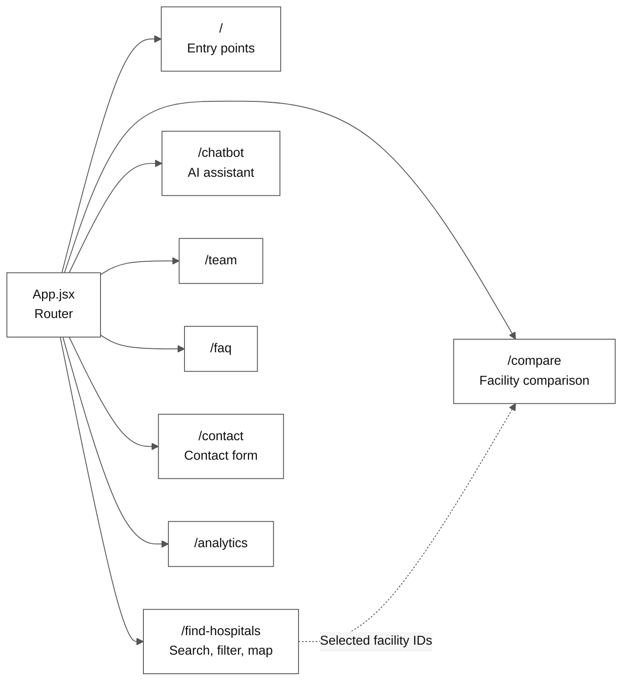
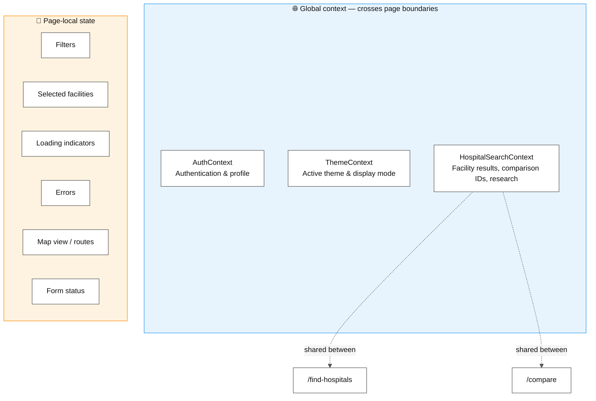
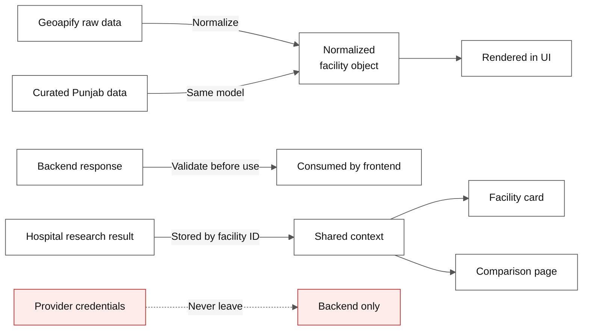

# 🏛️ CurePulse Architecture

## 📋 Table of contents

- [Architecture summary](#-architecture-summary)
- [Repository organization](#-repository-organization)
- [Route architecture](#-route-architecture)
- [Shared state](#-shared-state)
- [Main data boundaries](#-main-data-boundaries)
- [Maintainability principles](#-maintainability-principles)
- [Why this architecture fits the product](#-why-this-architecture-fits-the-product)

---

## 🧭 Architecture summary

CurePulse uses a **React single-page frontend** with an **Express backend**. The frontend owns page composition, interaction, local UI state, and presentation. The backend owns provider orchestration, file processing, and credentials that must not be exposed in the browser.

> **Layer principle:** the frontend never talks to a credentialed provider directly — every such call is routed through the Express layer, which orchestrates the provider and returns a normalized response.

---

## 📁 Repository organization

| Directory | Responsibility |
| --- | --- |
| `src/pages` | Route-level screens and feature composition |
| `src/components` | Reusable UI and composed layout components |
| `src/context` | Shared authentication, theme, and search state |
| `src/services` | External service clients such as Geoapify |
| `src/utils` | Focused reusable helpers and domain logic |
| `src/server` | Express routes, provider calls, and file processing |
| `src/styles` | Global resets, theme tokens, and design variables |
| `public` | Static assets and public documents |

---

## 🧭 Route architecture

Routes are defined in [`src/App.jsx`](../src/App.jsx):

| Route | Page responsibility |
| --- | --- |
| `/` | Product introduction and primary entry points |
| `/find-hospitals` | Search, filter, map, and facility selection |
| `/compare` | Compare selected facilities |
| `/chatbot` | AI healthcare assistant |
| `/team` | Team information |
| `/faq` | Common questions |
| `/contact` | Contact form |
| `/analytics` | Analytics view |

---

## 🔗 Shared state

- **`AuthContext`** manages authentication and profile state.
- **`ThemeContext`** manages the active visual theme and display mode.
- **`HospitalSearchContext`** shares facility results, comparison IDs, and research results between the finder and comparison pages.
- **Page-local state** controls filters, selected facilities, loading indicators, errors, map view, routes, and form status.

> This keeps global state limited to information that genuinely crosses page boundaries.

---

## 🧱 Main data boundaries

- Geoapify data is transformed into a **normalized facility object** before it is rendered.
- Backend responses are **checked before their data is consumed**.
- Curated Punjab hospitals use the **same facility model** as live results.
- Hospital research is **stored by facility ID** so cards and comparison can reuse it.
- Provider credentials **remain on the backend**.

---

## 🛠️ Maintainability principles

- Use single-purpose modules and functions.
- Keep external integrations behind service or server boundaries.
- Reuse shared components and theme tokens.
- Keep loading, empty, error, and success states explicit.
- Use descriptive names and avoid duplicated domain logic.
- Preserve the normalized facility shape across search modes.
- Make changes in the narrowest appropriate layer.

---

## 💡 Why this architecture fits the product

The architecture allows the hospital finder, map, comparison, and research features to share **one facility model** without duplicating presentation logic. Provider integrations can change independently from the UI, while context providers preserve important user selections across pages. This supports incremental growth without turning the application into one tightly coupled component.
