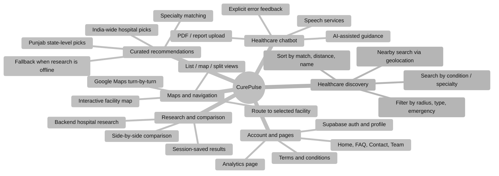
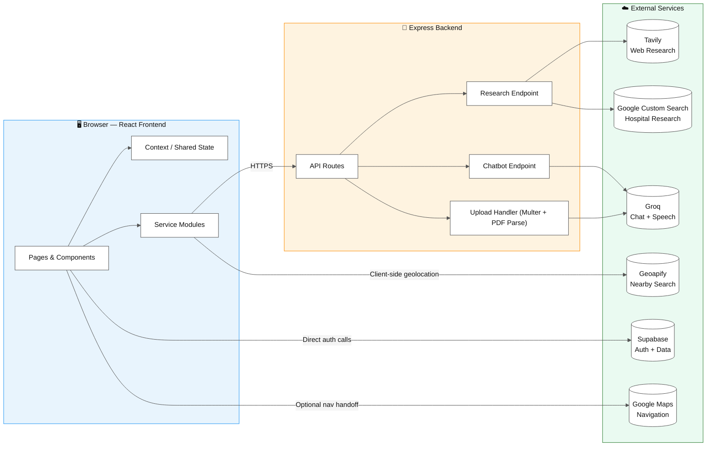
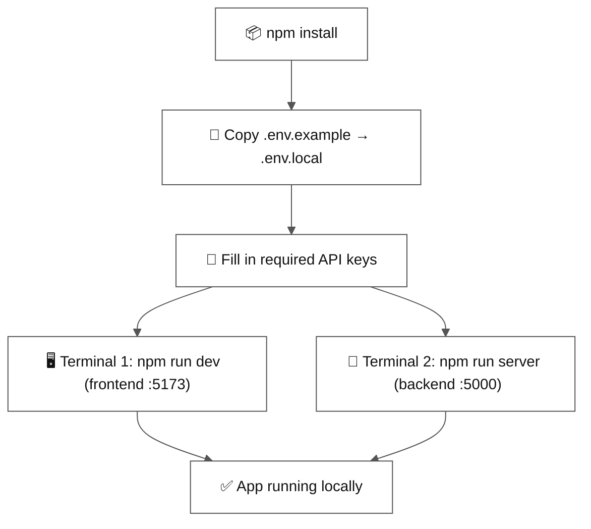
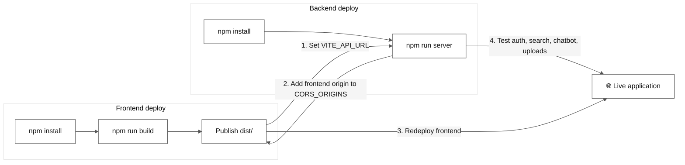
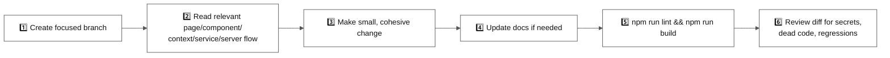

# 🩺 CurePulse


**URL OF SITE : https://built-techies.vercel.app/**

**TUTORIAL CHANNEL LINK : https://www.youtube.com/channel/UCRLxQmWOeqUaF-BiYWLcbhA**

**NOTE : Dear judges and evaluators are kindly requested to visit PROJECT INFORMATION folder and go through markdown files to get basic information about the artitecture.**
**Thanks** 


**A healthcare discovery and navigation platform for India** — helping people find, compare, and understand healthcare options through location-aware search, curated recommendations, maps, and an AI-assisted chatbot.


> ⚠️ **Medical safety notice:** CurePulse is an information and discovery tool. It does **not** replace a qualified medical professional. Always verify hospital availability, departments, doctors, schedules, and emergency services directly with the provider. **Do not use this application for urgent medical emergencies.**

---

## 📋 Table of contents

- [Feature overview](#-feature-overview)
- [System architecture](#-system-architecture)
- [Technology stack](#-technology-stack)
- [Repository structure](#-repository-structure)
- [Environment setup](#-environment-setup)
- [Available npm scripts](#-available-npm-scripts)
- [Production build and deployment](#-production-build-and-deployment)
- [Code quality and maintainability](#-code-quality-and-maintainability)
- [Validation checklist](#-validation-checklist)
- [Contribution workflow](#-contribution-workflow)
- [License](#-license)

---

## ✨ Feature overview



| Area | Highlights |
| --- | --- |
| 🔎 **Healthcare discovery** | Search by condition, treatment, specialty, or care type; nearby search via browser geolocation; filter by radius, facility type, emergency availability; sort by match, distance, or name; explicit loading/empty/error/success states |
| ⭐ **Curated recommendations** | India-wide researched picks, Punjab state-level picks, specialty matching (kidney, cardiology, cancer, neurology, ortho, eye, pediatrics, women's health, general medicine), graceful fallback when live research is unavailable |
| 🗺️ **Maps and navigation** | Interactive facility map, select from list or map, route requests, Google Maps turn-by-turn handoff, split/list/map views |
| 🏥 **Research and comparison** | Backend-driven hospital research, session-persisted results, multi-facility comparison across specialties, distance, emergency availability, and research data |
| 🤖 **Healthcare chatbot** | AI-assisted guidance, PDF/report upload where configured, speech services when credentials are available, explicit error states instead of silent failures |
| 👤 **Account & pages** | Supabase-backed auth and profiles, Home, FAQ, Contact (with local confirmation feedback), Team, Analytics, Terms & Conditions |

---

## 🏗️ System architecture



**Why this split matters:** the Express backend keeps provider integrations and sensitive API credentials (Groq, Tavily, Google Search) out of the browser, while the React frontend calls Supabase directly for auth and Geoapify directly for client-side geolocation search.

---

## 🧰 Technology stack

### Runtime and build tooling

| Technology | Version | Purpose |
| --- | --- | --- |
| Node.js | 18+ recommended | JavaScript runtime |
| npm | Bundled with Node.js | Package management and scripts |
| Vite | `^7.2.4` | Frontend dev server and production bundling |
| ESLint | `^9.39.5` | Static analysis and code-quality checks |

### Frontend dependencies

| Dependency | Version | Purpose |
| --- | --- | --- |
| React | `^19.2.0` | Component-based UI |
| React DOM | `^19.2.0` | Browser rendering |
| React Router DOM | `^7.18.4` | Client-side routing |
| Leaflet | `^1.9.4` | Map rendering support |
| React Leaflet | `^5.0.0` | React bindings for Leaflet |
| MapLibre GL | `^6.11.0` | Interactive map rendering |
| Lucide React | `^1.47.0` | UI icons |
| Supabase JS | `^2.116.0` | Frontend authentication and Supabase access |

### Backend and integration dependencies

| Dependency | Version | Purpose |
| --- | --- | --- |
| Express | `^5.2.1` | HTTP API server |
| CORS | `^2.8.6` | Cross-origin request configuration |
| dotenv | `^18.0.2` | Environment configuration |
| Groq SDK | `^1.6.0` | AI chatbot and speech integrations |
| Multer | `^2.4.0` | Multipart and file upload handling |
| PDF Parse | `^2.4.5` | PDF text extraction |
| Supabase | `^2.117.0` | Supabase tooling / server support |
| Nodemon | `^3.1.14` | Dev-only server auto-restart |

### External services

| Service | Role | Required? |
| --- | --- | --- |
| **Supabase** | Authentication and hosted data | ✅ Core |
| **Geoapify** | Nearby healthcare and geolocation search | ✅ Core |
| **Groq** | Chatbot and speech model access | ✅ Core |
| **Tavily** | Web research integration | ⚙️ Optional |
| **Google Maps** | Maps / navigation | ⚙️ Optional |
| **Google Custom Search** | Hospital research | ⚙️ Optional |

> Exact dependency declarations live in [`package.json`](./package.json). Install lockfile-resolved versions with `npm install` rather than adding packages manually.

---

## 📁 Repository structure

```text
.
├── public/                 # Static assets and public documents
├── documents/               # Project documents
├── src/
│   ├── components/          # Reusable and composed UI components
│   ├── context/              # Shared React state and providers
│   ├── pages/                 # Route-level screens and feature flows
│   ├── services/              # External API/service clients
│   ├── utils/                  # Focused reusable helpers
│   ├── server/                 # Express API and backend integrations
│   ├── App.jsx                 # Browser routes
│   ├── App.css                 # Application styles
│   └── index.css               # Global styles and design tokens
├── .env.example             # Environment variable template
├── eslint.config.js          # ESLint configuration
├── index.html                 # Vite entry document
├── package.json               # Scripts and dependencies
├── PROJECT INFORMATION/  # Judge-facing product and architecture docs
└── README.md                 # Project documentation
```

---

## ⚙️ Environment setup

### Prerequisites

- ✅ Node.js 18 or newer
- ✅ npm
- ✅ A Supabase project for authentication features
- ✅ API credentials for any external features you intend to enable
- ✅ A browser that supports geolocation, if nearby search is required

### Setup flow



### Create local environment files

**Windows PowerShell:**

```powershell
Copy-Item .env.example .env.local
```

**macOS / Linux:**

```bash
cp .env.example .env.local
```

### Environment variables

| Variable | Scope | Description |
| --- | --- | --- |
| `VITE_SUPABASE_URL` | Frontend | Supabase project URL |
| `VITE_SUPABASE_PUBLISHABLE_KEY` | Frontend | Supabase publishable key |
| `VITE_GEOAPIFY_API_KEY` | Frontend | Geoapify search/geolocation key |
| `VITE_API_URL` | Frontend | Express API URL (`http://localhost:5000` locally) |
| `PORT` | Backend | Express listening port (`5000` locally) |
| `CORS_ORIGINS` | Backend | Comma-separated allowed frontend origins |
| `FRONTEND_URL` | Backend | Public frontend URL used by the backend |
| `GROQ_API_KEY` | Backend | Groq API credential |
| `GROQ_CHAT_MODEL` | Backend | Chat model identifier |
| `GROQ_STT_MODEL` | Backend | Speech-to-text model identifier |
| `TAVILY_API_KEY` | Backend | Optional research credential |
| `GOOGLE_MAPS_API_KEY` | Backend | Optional Google Maps credential |
| `GOOGLE_SEARCH_API_KEY` | Backend | Optional Google Search credential |
| `GOOGLE_SEARCH_ENGINE_ID` | Backend | Optional Google Search engine ID |

> The complete variable template is in [`.env.example`](./.env.example). **Never commit** `.env.local`, API keys, service-role keys, or other credentials.

### Start the development environment

```bash
# Terminal 1 — frontend
npm run dev

# Terminal 2 — backend
npm run server
```

| Service | Default local URL |
| --- | --- |
| Frontend | `http://localhost:5173` |
| Backend | `http://localhost:5000` |

If the frontend or backend uses a different port, update `VITE_API_URL`, `CORS_ORIGINS`, and `FRONTEND_URL` consistently.

---

## 📜 Available npm scripts

| Command | Description |
| --- | --- |
| `npm run dev` | Start the Vite development server |
| `npm run server` | Start the Express backend |
| `npm run build` | Build the frontend for production |
| `npm run preview` | Serve the production build locally |
| `npm run lint` | Run ESLint across the repository |

---

## 🚀 Production build and deployment

### Build locally

```bash
npm run lint
npm run build
npm run preview
```

The generated frontend files are written to `dist/`. The preview server is for local verification only — it is not a replacement for a production hosting service.

### Deployment flow



### Frontend deployment

Deployable to any static host — **Vercel**, **Netlify**, **Cloudflare Pages**, or equivalent.

```text
Install command:   npm install
Build command:     npm run build
Output directory:  dist
```

Configure these frontend environment variables in the hosting provider:

- `VITE_SUPABASE_URL`
- `VITE_SUPABASE_PUBLISHABLE_KEY`
- `VITE_GEOAPIFY_API_KEY`
- `VITE_API_URL` → pointing to the deployed Express API

> Because the app uses client-side routing, configure the host to rewrite unknown routes to `index.html`.

### Backend deployment

Deployable to any Node-compatible service — **Render**, **Railway**, **Fly.io**, or a managed VM.

```text
Install command: npm install
Start command:   npm run server
```

Configure the backend environment variables:

- `PORT` (use the port supplied by the hosting provider when required)
- `CORS_ORIGINS` containing the deployed frontend origin
- `FRONTEND_URL` containing the deployed frontend URL
- `GROQ_API_KEY` and model variables
- Optional research, maps, and search credentials

### Post-deployment checklist

1. ☐ Set `VITE_API_URL` on the frontend to the public backend URL
2. ☐ Add the frontend URL to `CORS_ORIGINS`
3. ☐ Redeploy the frontend so the build contains the correct API URL
4. ☐ Test authentication, hospital search, chatbot requests, uploads, and contact flows from the deployed frontend

### 🔒 Deployment security checklist

- ☐ Keep all secret provider keys on the backend unless a provider explicitly requires a publishable browser key
- ☐ Never expose Supabase service-role keys in `VITE_*` variables
- ☐ Restrict `CORS_ORIGINS` to known production and preview origins
- ☐ Use HTTPS for both frontend and backend deployments
- ☐ Configure file upload limits and review server logs for unexpected traffic
- ☐ Verify third-party provider quotas and error behavior before launch

---

## 🧹 Code quality and maintainability

The source code should strictly follow clean-code principles, with proper structure, modularization, and legibility. Architectural design, code organization, and long-term maintainability are first-class evaluation criteria.

- Keep route pages focused on feature composition
- Place reusable UI in `src/components`
- Place external calls in `src/services` or backend route modules
- Keep shared state in the existing context/provider layer
- Prefer small, named, single-purpose functions
- Use descriptive names and avoid duplicated constants
- Render explicit loading, empty, success, and error states
- Validate API responses before consuming them
- Avoid broad catches, silent failures, and unreported invalid states
- Keep styles close to their feature and shared tokens global
- Reuse existing patterns before adding dependencies or abstractions
- Run lint and build checks before submitting changes

📖 See [`PROJECT INFORMATION/artitecture.md`](./PROJECT%20INFORMATION/artitecture.md) for full architecture and maintainability guidance.

---

## ✅ Validation checklist

Before opening a pull request or deploying:

```bash
npm run lint
npm run build
```

Also verify manually:

- ☐ The frontend loads without console errors
- ☐ API requests target the intended backend URL
- ☐ CORS allows the deployed frontend and rejects unintended origins
- ☐ Nearby search handles denied or unavailable location permission
- ☐ Loading and empty states are visible during asynchronous searches
- ☐ Hospital details, comparison, routing, and research actions work
- ☐ Chatbot and PDF features fail with clear user-facing messages when keys are unavailable
- ☐ No credentials or local environment files appear in the diff

---

## 🔀 Contribution workflow



---

## 📄 License

This project is maintained as part of the **BuiltTechies** project. Add the final license terms here before distributing the software.
